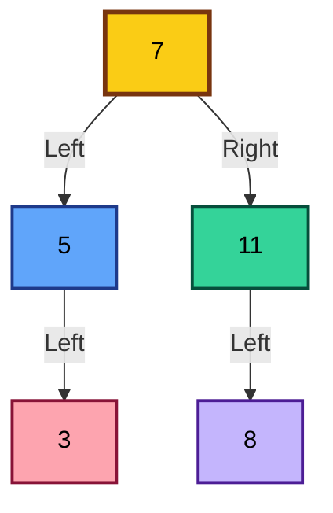

<h1 align="center">🌳 Data Structures Lab – Binary Search Trees (BST) (Java)</h1>


---

## 📺 Lecture Video

### 🎥 BST Lab Lecture

👉 https://youtu.be/D59gN8u2XyY

---

## 1. 🌟 Introduction to Binary Search Trees

**A Binary Search Tree (BST) is a specialized form of a binary tree** designed to support **efficient searching, insertion, and deletion** operations.

Unlike a general binary tree, a BST enforces a **strict ordering** rule on its nodes, which allows it to behave similarly to **binary search on arrays**, but with dynamic size.

---

## 2. 📘 Formal Definition

A **Binary Search Tree** is a binary tree where for every node `N`:

- All values in the **left subtree** of `N` are **strictly less** than `N.data`
- All values in the **right subtree** of `N` are **strictly greater** than `N.data`
- Both left and right subtrees are **themselves Binary Search Trees**

This recursive definition is the foundation of **all BST algorithms**.

---

## 3. 🔍 Binary Tree vs Binary Search Tree

| Aspect            | Binary Tree       | Binary Search Tree  |
| ----------------- | ----------------- | ------------------- |
| Node ordering     | No ordering       | Ordered             |
| Search complexity | O(n)              | O(log n) average    |
| Inorder traversal | Arbitrary order   | Sorted order        |
| Dynamic insertion | Yes               | Yes                 |
| Use cases         | Hierarchical data | Searching, indexing |

➡️ **Key Insight:**

A BST is not just a tree — it is a **search structure**.

---

## 4. 🌲 BST Structure Example

Consider inserting the following values:

```bash
7, 11, 5, 8, 3
```

The resulting BST:



**Inorder Traversal Result**

```pgsql
3 → 5 → 7 → 8 → 11
```

**✅ Always sorted**

This is a **fundamental BST property** and will be reused in validation, range queries, and sorting.

---

## 5. 🧠 Core BST Operations (Conceptual View)

### 5.1 Insertion – Conceptual Explanation

Insertion follows **decision-based traversal**:

- Start from the root
- Compare value with current node
- Move left or right
- Insert when a `null` position is found

🔹 This preserves the BST property automatically.

---

### 5.2 Searching – Conceptual Explanation

Searching in a BST is equivalent to binary search:

- Each comparison **discards half of the tree**
- This is why BSTs are efficient

---

### 5.3 Deletion – Conceptual Explanation

Deletion is the **most complex BST operation** because the tree structure must remain valid.

There are **three distinct cases**, each requiring different handling.

---

## 6. 🧪 BST Implementation

### 6.1 Node Structure

```java
public static class Node<T> {
    T data;
    Node<T> left;
    Node<T> right;
}
```

**Explanation**

- Each node stores:
  - The value (`data`)
  - A reference to the left child
  - A reference to the right child
- No parent pointer is used (simplifies recursion)

---

### 6.2 BST Class Overview

```java
public class BST<T> {
    private Node<T> root;
}
```

- The BST is defined **only by its root**
- All operations are performed **recursively**
- This matches the recursive nature of trees

---

## 7. 🔨 Insert Operation (Detailed Walkthrough)

**Code**

```java
public Node insert(Node root, T element) {
    if (root == null)
        return new Node(element);

    if ((Integer) element < (Integer) root.data)
        root.left = insert(root.left, element);
    else
        root.right = insert(root.right, element);

    return root;
}
```

### Step-by-Step Explanation

#### 1. Base Case
- If current node is `null`, insertion location is found

#### 2. Recursive Case
- If value is smaller → recurse left
- Otherwise → recurse right

#### 3. Return root
- Ensures tree structure is preserved

### 📌 Teaching Note:

Insertion never rearranges existing nodes — it only adds a new leaf.

---

## 8. 🔍 Search Operation (Detailed Walkthrough)

**Code**

```java
public boolean search(Node root, T element) {
    if (root == null)
        return false;

    if ((Integer) element == (Integer) root.data)
        return true;

    if ((Integer) element < (Integer) root.data)
        return search(root.left, element);
    else
        return search(root.right, element);
}
```

### Explanation

- Stops immediately when:
  - Node is `null` → not found
  - Value matches → found
- Recursive narrowing of search space

### ⏱ Time Complexity

- Average: `O(log n)`
- Worst (skewed tree): `O(n)`

---

## 9. ❌ Delete Operation (Full Professional Explanation)

### Case 1: Node with No Children (Leaf)

```csharp
Simply remove the node
```

### Case 2: Node with One Child

```csharp
Replace node with its child
```

### Case 3: Node with Two Children (Critical Case)

When the node to be deleted has **two children**, it **cannot be removed directly** without breaking the Binary Search Tree property.
Instead, its value must be replaced with a value that preserves ordering, and then that replacement node is removed.

---

### ✔ Valid Replacement Choices

There are **two correct and equivalent choices** for replacement:

### 1️⃣ Inorder Predecessor (Maximum in Left Subtree)

- The **largest value in the left subtree**
- Found by going:
  - One **step left**
  - Then **all the way right**

```css
max(left subtree)
```

### 2️⃣ Inorder Successor (Minimum in Right Subtree)

- The **smallest value in the right subtree**
- Found by going:
  - One step right
  - Then **all the way left**
 
```css
min(right subtree)
```

> Both values are guaranteed to maintain BST ordering after replacement.

---

### 📌 Why Do These Two Values Work?

Let the node to be deleted be `N`.

- All values in the left subtree are `< N`
- All values in the right subtree are `> N`

Therefore:

- The **maximum of the left subtree is**:
  - Greater than all left values
  - Smaller than all right values
- The** minimum of the right subtree is**:
  - Smaller than all right values
  - Greater than all left values

➡️ Replacing `N` with either one preserves the BST invariant.

---

### 🧠 Important Teaching Insight

> **BST deletion does not remove the node immediately.**
> **It replaces the node’s value, then deletes a simpler node (leaf or single-child).**

This reduces a complex problem into an easier one.

---

### 🔧 Choice Used in This Implementation

In **our code**, we use the **inorder successor** strategy:

> ✅ **Minimum value from the right subtree**

---

### 💻 Code Snippet (From Our BST)

```java
// Find inorder successor (minimum in right subtree)
Node<T> min = root.right;
while (min.left != null) {
    min = min.left;
}

// Replace current node's value
root.data = min.data;

// Delete the inorder successor
root.right = delete(root.right, min.data);
```

---

### 🧩 What Happens After Replacement?

- The tree still satisfies BST ordering
- The successor node:
  - Has at most one child
  - Is deleted using Case 1 or Case 2
- Structural correctness is preserved

---

## 10. 🎯 Student Activities (Independent Practice)

> ❗ No solutions are provided in this repository.

| Task                 | Core Skill            |
| -------------------- | --------------------- |
| Find Min & Max       | Tree extremities      |
| Validate BST         | Recursive constraints |
| Count Nodes in Range | Ordered traversal     |
| Sorted Array to BST  | Divide & conquer      |

---

## 11. 📂 Repository Structure

```pgsql
java-ds-lab-bst/
│
├── README.md
│
├── assignment/
│   └── README.md
│
├── src/
│   ├── examples/
│   │   └── BST.java
│   │
│   ├── activities/
│   │   ├── FindMinMax.java
│   │   ├── ValidateBST.java
│   │   ├── CountNodesInRange.java
│   │   └── SortedArrayToBST.java
│   │
│   └── chapters/
│       └── Lecture 07 - Binary Search Trees.pdf
```

---

## 12. 🎓 Learning Outcomes

By the end of this lab, students will be able to:

- Formally define a BST
- Implement core BST operations
- Analyze time complexity
- Solve common BST problems
- Prepare for AVL Trees

---

## 13. 📝 License

This repository is provided strictly for **educational purposes** as part of the **Java Data Structures Lab**.
